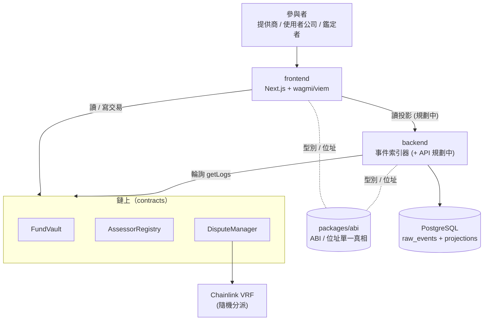
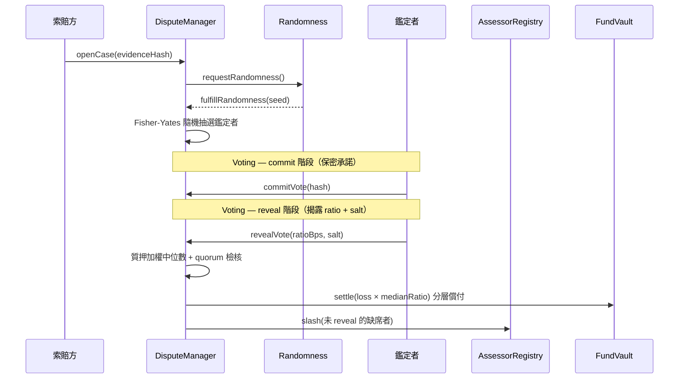
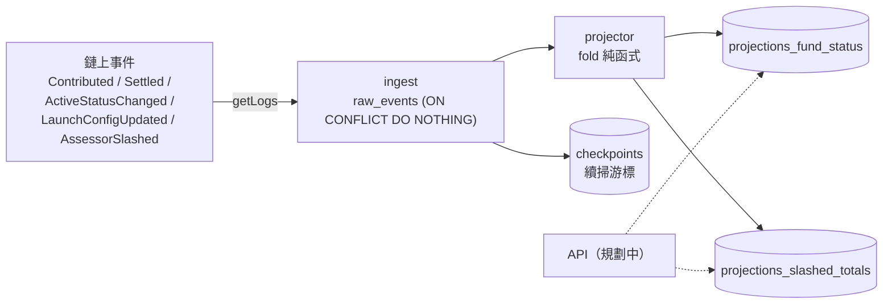

# AI 共險基金（AI Co-Insurance Fund）

> **雙邊質押、自動執行、設上限**的去中心化 AI 品質保證與責任分攤協議。
> 合約管錢與規則，鏈下對抗式鑑定判真相。

當 AI 從工具演進為全權代理人，「AI 出錯誰負責」成為責任真空。本協議讓 AI 提供商與使用者公司**雙邊質押注資**，由智慧合約託管資金、自動執行規則，並由有質押綁定的專業鑑定者透過**保密投票（commit-reveal）** 對爭議做對抗式鑑定。

> 📖 完整協議願景與數學模型見 [白皮書](docs/BluePrint/AI共險基金白皮書.md)（v0.4 草案）。
> 🧭 AI agent / 開發者導航請從 [AGENTS.md](AGENTS.md) 開始。

---

## 📌 課堂交付版：如何開啟專案

如果你是從 GitHub clone 或從交付用的 `AI_Insurance_delivery.zip` 取得專案，請先進入專案根目錄。zip 版本請先解壓縮。

### 交付 zip 不包含的內容

為了避免檔案過大，交付壓縮檔不會包含可重新安裝或重新產生的資料：

- `node_modules/`
- `contracts/lib/`
- `contracts/out/`、`contracts/cache/`、`contracts/broadcast/`
- `.env`、`.env.*`
- `.dev/`
- `deployments/31337.json`

這些內容可透過下方指令重新建立；請不要手動把本機套件目錄包進作業 zip。

### 先備工具

請先安裝：

- Node.js 20 以上
- pnpm 11.9.0（可用 Corepack 安裝）
- Git
- Foundry（提供 `forge`、`anvil`、`cast`）
- Docker Desktop（用於本地 PostgreSQL）

### 第一次開啟

```bash
# 1. 進入專案根目錄後，啟用 pnpm
corepack enable
corepack prepare pnpm@11.9.0 --activate

# 2. 安裝前端 / 後端 / workspace 相依套件
pnpm install

# 3. 安裝合約外部依賴（二選一）
# GitHub clone 版本：
git submodule update --init --recursive

# zip 解壓版本：
git init
cd contracts
forge install foundry-rs/forge-std --no-commit
forge install OpenZeppelin/openzeppelin-contracts --no-commit
forge install smartcontractkit/chainlink-brownie-contracts --no-commit
cd ..

# 4. 一鍵啟動本地開發環境
pnpm dev
```

成功啟動後，開啟：

- 前端：http://localhost:3000
- 後端健康檢查：http://127.0.0.1:4000/api/v1/health

停止專案請在終端機按 `Ctrl-C`。若要清空本地資料庫與容器資料，執行：

```bash
pnpm dev:reset
```

### 只想檢查合約或前端

```bash
# 合約編譯與測試
cd contracts
forge build
forge test

# 前端開發伺服器（需先回到根目錄並完成 pnpm install）
cd ..
pnpm build:abi
cd frontend
pnpm dev
```

更完整的開發環境說明可見 [docs/guides/dev-setup.md](docs/guides/dev-setup.md)。

---

## 🎯 核心機制

| 機制         | 一句話說明                                                              | 規格                                          | 合約                          |
| ------------ | ----------------------------------------------------------------------- | --------------------------------------------- | ----------------------------- |
| 雙邊質押注資 | 提供商與使用者公司各自注資，合約託管成共同保障池                         | 白皮書 §6.1                                   | `FundVault`                   |
| 分層償付     | 損失依「自付額 → 共保池 → 殘餘層」三層填補，池支付設上限                  | [tranche.md](docs/specs/tranche.md)           | `TrancheMath` / `FundVault`   |
| 保密投票鑑定 | 隨機抽選有質押的鑑定者，commit-reveal 防搭便車，質押加權中位數定責任比例 | [commit-reveal.md](docs/specs/commit-reveal.md) | `DisputeManager` / `VoteTally` |
| 缺席罰沒     | 未在投票窗內 reveal 的鑑定者遭 `slash`，維持鑑定誘因                     | 白皮書 §6.5                                   | `DisputeManager` / `AssessorRegistry` |
| 動態費率     | 以信度 Z 在「經驗費率 ↔ 人工費率」間加權，並對提供商設上限               | [dynamic-rate.md](docs/specs/dynamic-rate.md) | `RateMath`                    |
| 啟動門檻     | 參與數、總注資、集中度（HHI / η）達標才允許基金 `active`                 | 白皮書 §6.1.1                                 | `LaunchMath` / `FundVault`    |

---

## 🏛️ 系統架構

核心原則：**鏈管錢，不管真相**。合約是唯一權威執行層；後端只做索引、暫存與輔助流程，**不得**成為資金或判定的權威。

### 元件總覽



### 爭議生命週期（鏈上狀態機）



### 後端索引資料流

事實與投影分離：`raw_events` 為單一事實來源（唯一鍵冪等），投影由純函式摺疊產生，ingest 與 projection 在**同一 DB 交易**內完成以保一致。



---

## 📁 專案結構

pnpm workspaces 管理的 monorepo：

```
AI_Insurance/
├── AGENTS.md              # AI agent / 開發者導航地圖
├── pnpm-workspace.yaml    # packages/* + frontend + backend
├── deployments/           # <chainId>.json 部署位址（abi 管線來源）
├── docs/                  # 設計知識（白皮書、規格、架構、ADR、API、指南）
│   ├── BluePrint/         # 白皮書（協議願景與數學模型）
│   ├── specs/             # 白皮書 → 程式碼的可實作規格
│   ├── architecture/      # 系統架構與分層約定
│   ├── adr/               # 架構決策紀錄
│   ├── api/               # 後端 API 契約
│   └── guides/            # 開發環境 / 部署 / 貢獻
├── contracts/             # Solidity 智慧合約（Foundry）
│   ├── src/
│   │   ├── libraries/     # 純函式：TrancheMath / VoteTally / RateMath / LaunchMath
│   │   ├── core/          # 持狀態：FundVault / AssessorRegistry / DisputeManager
│   │   ├── adapters/      # ChainlinkVRFAdapter
│   │   ├── interfaces/    # I 開頭介面
│   │   └── access/        # Roles
│   ├── test/              # 單元 + fuzz + 整合測試
│   └── script/            # 部署腳本
├── frontend/              # Next.js 15 + wagmi 2 + viem 2
│   └── src/{app,features,hooks,lib}/
├── backend/               # Node.js + TS 事件索引器（六角架構）
│   ├── migrations/        # PostgreSQL schema
│   └── src/{domain,application,infrastructure}/
└── packages/
    └── abi/               # @ai-insurance/abi：ABI / 位址 / 型別單一真相
```

---

## 🚀 快速開始

### 先備工具

- [Foundry](https://book.getfoundry.sh/)（合約建置 / 測試 / 部署）
- Node.js ≥ 20 與 [pnpm](https://pnpm.io/) ≥ 11
- PostgreSQL ≥ 14（後端索引器；可用 Docker）
- Git

詳細步驟與疑難排解見 [docs/guides/dev-setup.md](docs/guides/dev-setup.md)。

### 一鍵啟動（推薦）

備妥 Foundry、Node ≥ 20 + pnpm、Docker 後，於專案根目錄執行：

```bash
pnpm dev
```

此指令會自動：起 PostgreSQL（容器）→ 起 anvil → 部署合約 → 產位址表並建置 ABI → 套用後端 migration → 同時啟動後端索引器與前端。完成後開 http://localhost:3000，按 `Ctrl-C` 一併關閉所有服務。

| 指令            | 作用                                          |
| --------------- | --------------------------------------------- |
| `pnpm dev`      | 本地端到端一鍵啟動（見上）                    |
| `pnpm dev:down` | 停止 PostgreSQL 容器（保留資料卷）            |
| `pnpm dev:reset`| 移除 PostgreSQL 容器與資料卷（清空索引資料）  |

> 編排腳本見 [scripts/dev-up.sh](scripts/dev-up.sh)；基礎設施定義見 [docker-compose.yml](docker-compose.yml)。

### 手動安裝與本地端到端

若想理解每個環節，可改以手動步驟逐步執行：

```bash
# 1. 安裝相依套件（整個 workspace）
pnpm install

# 2. 建置合約並產生 ABI
cd contracts && forge build && cd ..
pnpm gen:abi

# 3. 啟動本地鏈並部署（另開終端執行 anvil）
anvil
pnpm deploy:local        # 部署完整系統，寫出 deployments/31337.json
pnpm gen:addresses       # 由部署檔產生位址表

# 4. 啟動前端
cd frontend && pnpm dev  # http://localhost:3000

# 5. 啟動後端索引器（需先備妥 PostgreSQL 並設定 backend/.env）
cd backend && pnpm migrate && pnpm dev
```

---

## 🛠️ 開發工作流

### 根目錄指令（pnpm workspaces）

| 指令                 | 作用                                            |
| -------------------- | ----------------------------------------------- |
| `pnpm gen:abi`       | 由 `contracts/out` 產生 `packages/abi` 的 ABI   |
| `pnpm deploy:local`  | 對本地 anvil 部署，寫出 `deployments/31337.json` |
| `pnpm gen:addresses` | 由部署檔產生位址表                              |
| `pnpm build:abi`     | 編譯 `@ai-insurance/abi`                         |
| `pnpm test:abi`      | abi 套件煙霧測試                                |
| `pnpm typecheck`     | 建置 abi 後對全工作區型別檢查                    |

### 各 package 指令

```bash
# 合約
cd contracts
forge build && forge test && forge fmt --check

# 前端
cd frontend
pnpm dev && pnpm typecheck

# 後端索引器
cd backend
pnpm dev          # tsx watch（poll loop）
pnpm migrate      # 套用 DB schema
pnpm test         # 單元測試
pnpm test:integration   # 真實 PostgreSQL 整合測試（需 TEST_DATABASE_URL）
```

---

## 🧪 測試

| 層級         | 範圍                                                            | 指令                                     |
| ------------ | --------------------------------------------------------------- | ---------------------------------------- |
| 合約單元/fuzz | 數學庫、核心合約、VRF adapter（**101 個測試函式**）             | `cd contracts && forge test`             |
| 合約整合     | DisputeManager → FundVault 端到端                               | `forge test --match-path *Integration*`  |
| 後端單元     | 投影映射、冪等、checkpoint 計算                                 | `cd backend && pnpm test`                |
| 後端整合     | 真實 PostgreSQL：raw_events 冪等、續掃、投影數值                | `pnpm --filter @ai-insurance/backend test:integration` |
| ABI 煙霧     | `getContractConfig` 與 ABI 匯出                                | `pnpm test:abi`                          |

---

## 📦 技術棧

- **合約**：Solidity、Foundry、OpenZeppelin、Chainlink VRF v2.5
- **前端**：Next.js 15、React 19、wagmi 2、viem 2、TanStack Query、Tailwind CSS 3
- **後端**：Node.js ≥ 20、TypeScript、viem、pg（PostgreSQL）、zod、pino（六角架構）
- **共享**：`@ai-insurance/abi`（@wagmi/cli 由 Foundry 產生 ABI 與型別）
- **工具鏈**：pnpm workspaces

---

## 🏗️ 實作狀態

圖例：✅ 已完成　🚧 部分 / 進行中　⬜ 未開始

### 合約（`contracts/`）— ✅ 功能完整，待審計

| 模組                           | 狀態 | 說明                                                         |
| ------------------------------ | ---- | ------------------------------------------------------------ |
| `libraries/TrancheMath`        | ✅   | 三層償付計算 + fuzz                                          |
| `libraries/VoteTally`          | ✅   | 質押加權中位數 + quorum                                      |
| `libraries/RateMath`           | ✅   | 信度加權動態費率（純函式）                                   |
| `libraries/LaunchMath`         | ✅   | HHI / η 集中度與啟動門檻評估                                 |
| `core/FundVault`               | ✅   | 注資、記帳、分層結算、啟動門檻                               |
| `core/AssessorRegistry`        | ✅   | 註冊 / 質押 / 列舉 / 罰沒                                    |
| `core/DisputeManager`          | ✅   | 開案 → 隨機分派 → commit-reveal → 加權結算 → 缺席罰沒        |
| `adapters/ChainlinkVRFAdapter` | ✅   | VRF v2.5（一次性 `setConsumer` 解循環依賴）                  |
| 測試                           | ✅   | 101 個測試函式（單元 + fuzz + 整合），build / fmt 乾淨       |

**延後項（未實作）**：完整有狀態費率控制器（LR/CR 追蹤、接保費）、罰沒質押再分配入庫、公信力 Ω / 專業係數加權、上訴 / 重抽層、洩密檢舉。詳見 [deployment.md §1](docs/guides/deployment.md)。

### 後端（`backend/`）— 🚧 索引器可運作，API 未建

| 部分                          | 狀態 | 說明                                                       |
| ----------------------------- | ---- | ---------------------------------------------------------- |
| 事件索引器（六角架構）        | ✅   | 輪詢 ingest → 投影 → checkpoint 續掃，單一交易保一致       |
| DB schema + migration         | ✅   | `raw_events` / `checkpoints` / `projections_*` 四表        |
| 投影：基金狀態 / 罰沒彙總     | ✅   | 純函式摺疊 + UPSERT；Settled 以 `poolPayout` 計            |
| 單元 + 整合測試               | ✅   | 映射 / 冪等 / 續掃；整合測試需 PostgreSQL                  |
| HTTP API（REST）              | ⬜   | 端點與 schema 規劃中，見 [api/overview.md](docs/api/overview.md) |
| KYC / 准入流程                | ⬜   | 未開始                                                     |
| 證據暫存 / 摘要               | ⬜   | 未開始                                                     |
| DisputeManager 事件投影       | ⬜   | 已納入監聽配置，投影聚焦基金狀態 / 罰沒                    |
| reorg 回捲                    | ⬜   | 目前僅以 confirmations 緩衝規避                            |

### 前端（`frontend/`）— 🚧 最小可運作

| 功能                          | 狀態 | 說明                                              |
| ----------------------------- | ---- | ------------------------------------------------- |
| 基金狀態唯讀檢視              | ✅   | `FundStatusCard` 批次讀取 active / 代幣 / 鑑定者數 / 罰沒總額 |
| 錢包連接（wagmi / RainbowKit）| ✅   | foundry 鏈（31337）/ anvil RPC                     |
| 注資 / 索賠寫入交易          | ⬜   | 未開始                                            |
| 投票 commit / reveal UI       | ⬜   | 未開始                                            |
| 爭議案件列表 / 詳情          | ⬜   | 未開始                                            |
| 費率 / 公信力查詢            | ⬜   | 未開始                                            |
| KYC 流程                      | ⬜   | 未開始                                            |

### 共享 / 基建 — ✅

| 項目                          | 狀態 | 說明                                              |
| ----------------------------- | ---- | ------------------------------------------------- |
| `@ai-insurance/abi` 管線      | ✅   | wagmi 由 Foundry 產生 ABI；位址由部署檔產生        |
| 部署腳本（本地 / mock / VRF） | ✅   | 三套腳本，含解循環依賴示範                         |
| 文件（白皮書 / 規格 / ADR）   | ✅   | 白皮書完整；三份核心規格與實作對齊                 |

---

## 🔒 安全考量

- **權威性**：所有資金 / 判定狀態以鏈上為準；後端僅索引與輔助，前端純展示。
- **機密管理**：私鑰、KYC 個資**切勿入版控**，使用 `.env` 與安全儲存。
- **示意參數待校準**：`d`、`k`、`A%`、`slashBps`、`quorumBps` 等皆為示意值，未經正式建模，勿當最終值。
- **治理**：正式環境的 admin / settler 應由治理流程持有，而非單一部署者 EOA。
- **審計**：合約上主網前須經第三方審計；白皮書為 v0.4 草案，機制仍可能調整。
- **VRF**：正式 VRF 需在 Chainlink 端將 adapter 加為 consumer 並充值，否則隨機分派無回應。

---

## 📚 文件導覽

| 我想…                  | 去這裡                                                |
| ---------------------- | ----------------------------------------------------- |
| 理解協議願景與機制     | [白皮書](docs/BluePrint/AI共險基金白皮書.md)          |
| 看可實作規格           | [docs/specs/](docs/specs/)                            |
| 建立全局心智模型       | [docs/architecture/overview.md](docs/architecture/overview.md) |
| 知道某技術決策的原因   | [docs/adr/](docs/adr/)                                |
| 串接後端 API           | [docs/api/overview.md](docs/api/overview.md)          |
| 設定開發環境           | [docs/guides/dev-setup.md](docs/guides/dev-setup.md)  |
| 部署合約 / 後端        | [docs/guides/deployment.md](docs/guides/deployment.md) |
| 貢獻流程               | [docs/guides/contributing.md](docs/guides/contributing.md) |

---

## 🤝 貢獻

請見 [docs/guides/contributing.md](docs/guides/contributing.md)。任何改動需同步更新對應 package 的 `AGENTS.md` 與相關 `docs/`。

---

> **狀態**：合約功能完整（待審計）｜後端索引器可運作（API 未建）｜前端最小可運作。
> 本協議仍為早期階段，白皮書 v0.4 草案，所有參數皆待正式建模與實證驗證。
